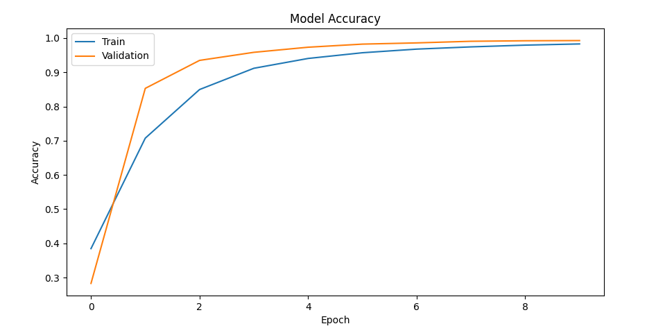
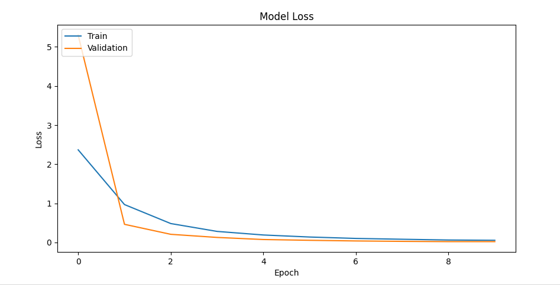

# 基于ResNet50的交通标志识别

## 数据集

该项目使用的是[**德国交通标志识别基准 (GTSRB) 数据集**](https://sid.erda.dk/public/archives/daaeac0d7ce1152aea9b61d9f1e19370/)。该数据集旨在训练交通标志识别算法，并在学术研究、竞赛、计算机视觉和深度学习领域作为评估基准被广泛使用。

## 方法论

### 数据预处理

1. 下载并解压数据集。

2. 读取 CSV 文件：
   - 提取图像的元数据（路径、ROI坐标、宽高、标签）存入 dataFrame 中，其中 ROI坐标存储形式为 (Roi.X1, Roi.Y1, Roi.X2, Roi.Y2)。

3. 图像裁剪：
   - 根据 ROI 坐标使用 image.cop() 方法裁剪图像并保存，最后生成新的 dataFrame (裁剪后的图像路径、标签)。
4. 打散数据集，然后划分训练集、验证集和测试集，比例为 6: 2: 2。
5. 预处理和数据增强：
   - 训练集：
     - 预处理：对 dataFrame 表格中的数据使用 flow_from_dataframe 方法。读取裁剪后的图像，调整尺寸为 64 * 64，归一化并将标签转换为独热编码。
     - 数据增强：使用 ImageDataGenerator 生成器每张进行数据增强（随机旋转、随机平移、随机剪切、随机缩放、随机翻转）并使用最邻近差值填充变换后的像素。
   - 验证集和测试集：只预处理但不进行数据增强。

### 模型构建

使用预训练模型 ResNet50，不包括顶层以自定义。

```python
# Input layer
input_tensor = Input(shape=(64, 64, 3))
base_model = ResNet50(weights='imagenet', include_top=False, input_tensor=input_tensor)

# Add a global average pooling layer.
x = base_model.output
x = GlobalAveragePooling2D()(x)

# Add a fully connected layer.
x = Dense(1024, activation='relu')(x)

# Add a final softmax layer, assuming there are 43 classes.
predictions = Dense(43, activation='softmax')(x)

# Define the entire model.
model = Model(inputs=base_model.input, outputs=predictions)

# To prevent overfitting.
# Unfreeze last 3 convolutional layers as convolutional layer
N = 3
count = 0
for layer in base_model.layers[::-1]:  # Iterate through the model's layers from back to front.
    if isinstance(layer, Conv2D):
        layer.trainable = True
        count += 1
        if count >= N:
            break
```

### 参数

| Optimizer | Learning rate | Loss                     | Metrics                     | Batch size |
| --------- | ------------- | ------------------------ | --------------------------- | ---------- |
| Adam      | 1e-5          | Categorical crossentropy | Accuracy, Precision, Recall | 32         |

## 结果展示



